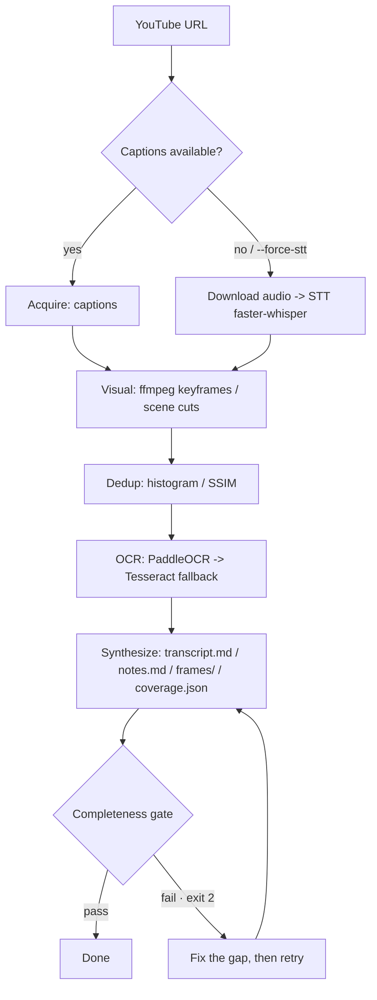

# LecturAL

> A Claude Code plugin that turns one YouTube video into complete markdown notes — **every utterance, every on-screen text, every scene**. Best on lecture and slide-style videos.

[](https://www.python.org/)
[](LICENSE)

## Features

- 🧾 **Full transcript + study notes** — a raw `transcript.md` (every utterance) and a seven-section `notes.md` (3줄 요약 / 목차 / 흐름 / 핵심 개념·이론 / 정리 노트 / 복습 질문 / 정리 커버리지). Note prose is Korean by design.
- 🔗 **Video deeplinks** — concept bullets and review-question answers carry `youtu.be?t=` links that jump to the exact moment.
- 🇰🇷 **Korean & English** — uses captions when available, falls back to speech-to-text (faster-whisper) otherwise.
- 🚧 **Completeness gate** — checks speech gaps, scene coverage, and artifact presence, and blocks "done" until they pass.

## How it works



## Requirements

- **Python 3.10+**
- **uv** — installs and runs the Python dependencies
- **ffmpeg** — system binary, must be on PATH
- **yt-dlp** — checked and installed by `/lectural:setup` (doctor)

## Install

### 1. Install the plugin (Claude Code)

```text
/plugin marketplace add haesol-shin/lectural
/plugin install lectural@lectural
```

This registers the completeness Stop hook and the `/lectural:notes` and `/lectural:setup` commands.

### 2. Prepare the runtime

Run once after installing:

```text
/lectural:setup
```

It installs the Python run dependencies → checks/repairs `ffmpeg` and `yt-dlp` → reports anything left to do.

> Manual setup: `uv pip install -e ".[run]"`, then install `ffmpeg` per OS (Windows `winget install --id Gyan.FFmpeg -e`, Linux `sudo apt-get install ffmpeg`, macOS `brew install ffmpeg`).

## Quick start

```text
/lectural:notes https://youtu.be/<VIDEO_ID>
```

Or run the CLI directly without Claude Code (ffmpeg must be installed separately):

```bash
uvx --from ".[run]" lectural "https://youtu.be/<VIDEO_ID>" --out ./output
```

## Usage

| Command | Description |
|---------|-------------|
| `/lectural:setup` | Prepare and verify the runtime (first run) |
| `/lectural:notes <url> [options]` | Turn a lecture URL into complete notes |

Options: `--force-stt` (ignore captions, force STT), `--model medium|small` (STT model size), `--out ./output` (output location). Pass multiple URLs to process them sequentially.

The commands run **only on explicit request** (they do not auto-trigger on a stray YouTube link). At session end, the Stop hook re-verifies note completeness.

## Output

```text
output/<video-title>/
├── transcript.md          # raw timestamped transcript — every utterance
├── notes.md               # study notes: seven sections + video deeplinks
├── frames/                # slide images
├── coverage.json          # completeness-gate results
└── synthesis_input.json   # text input used to enrich the notes
```

## FAQ

**No captions?** STT transcribes audio when captions are missing or weak (`--force-stt` forces it).

**Long video (1–2h)?** CPU STT gets slower with length; LecturAL warns on very long inputs, and `--model small` trades accuracy for speed.

**Empty OCR text on some frames?** Expected. Many frames (e.g. the speaker only) have no text, so OCR miss rate is not used as a gate.

## License

[MIT](LICENSE).
