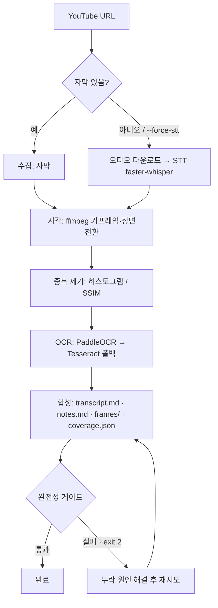

# LecturAL

> YouTube 영상 하나를 받아 **모든 발화·모든 화면 텍스트·모든 장면**을 빠짐없이 잡아 markdown 완전 노트로 만드는 Claude Code 플러그인 + 재사용 Python CLI. 강의/슬라이드형 영상에서 가장 빛납니다.

[](https://www.python.org/)

임의 요약으로 건너뛰지 않고, 빠진 게 없는지 **완전성 게이트가 자동으로 강제**합니다.

---

## 왜 LecturAL인가

- 🧾 **완전 전사본 + 학습 노트** — 모든 발화를 담은 raw `transcript.md`와 3줄 요약, 목차, 흐름, 핵심 개념·이론, 정리 노트, 복습 질문, 정리 커버리지 7개 섹션과 인용 딥링크를 포함한 `notes.md`를 생성합니다.
- 💸 **외부 LLM 토큰 0** — 전사·OCR·기본 학습 노트 전부 결정론적으로 생성. 노트 산문 보강은 이미 켜져 있는 호스트 에이전트(Claude)가 직접 하므로 별도 API 비용이 없습니다.
- 💻 **노트북(CPU)에서 동작** — GPU 불필요. `faster-whisper medium int8`을 CPU로 구동.
- 🇰🇷 **한국어·영어 자동** — 자막이 있으면 쓰고, 없으면 STT로 전사.
- 🚧 **누락 차단 게이트** — 대사 공백·장면 커버리지·산출물 존재를 검사해 통과 못 하면 "완료"를 막습니다.

## 동작 방식



`transcript.md`·OCR·기본 `notes.md`는 **LLM 없이** 만들어집니다. 순수 CLI 실행은 외부 LLM을 호출하지 않는 결정론적 저수준 산출물(`notes.md`, `transcript.md`, `coverage.json`, `synthesis_input.json`)만 남깁니다. 스킬로 실행할 때는 CLI 성공 뒤 호스트 에이전트가 `synthesis_input.json`(텍스트만, 이미지 미포함)을 읽어 `notes.md`의 미보강 산문 섹션을 보강하되, `NOTES_ENRICH_MARKER`(`<!-- lectural:notes -->`), 7개 섹션 앵커, 인용 딥링크, 전사 앵커, 정리 커버리지 푸터는 보존합니다. 순수 CLI는 결정론적 스켈레톤에서 멈추며 외부 LLM을 호출하지 않습니다.

## 요구 사항

- **Python 3.10+**
- **uv/uvx 런타임** — Python 실행 의존성(`.[run]`) 설치 또는 일회성 실행에 필요
- **ffmpeg** — 시스템 바이너리라 별도 설치 및 PATH 등록 필요
- **yt-dlp** — Python 실행 의존성과 PATH 바이너리 둘 다 `doctor`가 검사
- (선택) **Tesseract** — PaddleOCR가 안 될 때의 폴백 OCR

## 설치

설치는 두 단계입니다. 플러그인 설치가 먼저고, 그다음 호스트 에이전트가 런타임 의존성을 준비합니다.

### 1. 플러그인 설치 (Claude Code)

Claude Code에서 marketplace를 추가한 뒤 플러그인을 설치합니다:

```text
/plugin marketplace add <GITHUB_REPO_URL>
/plugin install lectural@lectural
```

설치하면 LecturAL 스킬과 완전성 Stop 훅이 등록됩니다. 강의 URL을 던지면 에이전트가 자동으로 이 파이프라인을 호출합니다.

### 2. 런타임 준비 (uv/uvx + ffmpeg)

플러그인 설치만으로는 **Python 실행 의존성, yt-dlp PATH 바이너리, ffmpeg**가 설치되지 않습니다. 플러그인을 먼저 설치한 뒤, 같은 checkout 또는 배포 루트에서 런타임을 준비합니다:

```bash
# 코어 + 실행 의존성(yt-dlp, faster-whisper, opencv, paddleocr 등) 설치
uv pip install -e ".[run]"
```

`ffmpeg`는 시스템 바이너리라 OS별로 따로 설치하고 PATH에서 실행 가능해야 합니다:

```bash
# Windows
winget install --id Gyan.FFmpeg -e

# Linux
sudo apt-get install ffmpeg
# 또는
sudo dnf install ffmpeg

# macOS
brew install ffmpeg
```

준비 상태는 `lectural doctor`로 확인합니다. 자동 수정은 안전하고 제한적입니다(`yt-dlp`는 `uv tool install yt-dlp` 시도, `ffmpeg`는 명백한 Windows/macOS 패키지 관리자만 시도하거나 힌트만 출력):

```bash
lectural doctor
lectural doctor --fix
lectural doctor --json
```
일반 manifest 게이트는 `lectural doctor`이며, 예전 dependency check/preflight 개념이 필요하면 `python -c "from lectural.deps import preflight; [print(s) for s in preflight()]"`로 직접 확인할 수 있습니다.

`lectural doctor` 종료 코드는 다음과 같습니다:

| 코드 | 의미 | 에이전트 동작 |
|------|------|---------------|
| `0` | 모든 구성 요소 준비 완료 | LecturAL 실행 진행 |
| `2` | 사용자 조치 필요(누락/불일치) | 첫 번째 항목과 힌트를 사용자에게 전달 후 중단 |
| `1` | 내부 오류 또는 자동 복구 불가 | doctor 출력 전체를 보고 후 중단 |

### uvx로 Python 의존성만 즉시 실행

로컬 editable 설치 없이 Python 실행 의존성(run extra)만 받아 CLI를 실행할 수도 있습니다:

```bash
uvx --from ".[run]" lectural "<url>" --out ./output
```

`uvx`는 Python 의존성(run extra)만 가져오며, `ffmpeg`는 시스템 바이너리라 별도 설치가 필요합니다(PATH 필수). 따라서 완전 무설치는 불가합니다.

## 빠른 시작

```bash
# 단일 강의
lectural "https://youtu.be/<VIDEO_ID>"

# 여러 강의 순차 처리
lectural "<url1>" "<url2>" --out ./output

# 자막을 믿지 못할 때 STT 강제
lectural "<url>" --force-stt --model medium
```

기대 출력:

```text
[OK] ./output/운영체제-1강/
완료 게이트는 CLI 종료 코드와 Claude Code Stop 훅(사용 시)이 함께 강제합니다.
```

## 출력 구조

```text
output/<video-title>/
├── transcript.md          # 원본 전사본(raw, 타임스탬프 포함) — 모든 발화
├── notes.md               # 학습 노트: 7개 섹션 스켈레톤 + 인용 딥링크 (호스트 에이전트가 산문 보강)
├── synthesis_input.json   # 호스트 에이전트 notes.md 보강 입력(텍스트만)
├── coverage.json          # 완전성 게이트 입력(대사 공백/장면 커버리지/산출물)
└── frames/                # 중복 제거된 슬라이드 이미지
```

## CLI 옵션

| 명령/옵션 | 설명 | 기본값 |
|-----------|------|--------|
| `lectural doctor` | Python 런타임, 외부 바이너리, 플러그인/스킬/훅 manifest 검사 | — |
| `lectural doctor --fix` | 안전한 범위에서 `yt-dlp`/`ffmpeg` 자동 수정 시도(최대 2패스) | off |
| `lectural doctor --json` | doctor 결과를 JSON(`schema_version`, `items`, `overall_status`, `exit_code`)으로 출력 | off |
| `urls` | YouTube URL 1개 이상(순차 처리) | — |
| `--force-stt` | 자막 무시하고 STT로 전사 | off |
| `--model` | faster-whisper 모델 크기 | `medium` |
| `--out` | 출력 루트 디렉터리 | `./output` |
| `--keep-frames` | 원본 샘플 프레임을 `frames/raw/` 아래 보존 | off |
```bash
lectural --help
```

## 완전성 게이트 (핵심)

LecturAL의 완료 판정은 두 계층입니다.

1. **1계층(주, 에이전트 무관): `lectural` CLI 종료 코드** — CLI는 모든 run의 `overall_pass`를 AND하여 하나라도 실패하면 non-zero(`2`)로 종료합니다. CLI를 감싸는 에이전트는 이 비정상 종료를 하드 실패로 취급해야 합니다.
2. **2계층(추가, Claude Code 전용): Stop 훅** — `scripts/completeness_hook.py`는 CLI를 호출하지 않고 run 상태(실패/미처리 거부), `coverage.json`, `notes.md`(`NOTES_ENRICH_MARKER` 1행 + 7개 섹션 앵커 + 프레임 이미지가 있을 때 슬라이드 이미지 링크)를 독립 검증합니다. 하나라도 걸리면 exit 2로 "완료"를 차단합니다.

Codex는 `AGENTS.md` 안내에 따라 CLI 종료 코드만 따릅니다. Claude Code Stop 훅은 Claude Code 세션에서 추가로 fail-closed를 보강하는 계층이며, CLI를 감싸는 래퍼가 아닙니다.

## 플러그인 / 스킬로 쓰기

`skills/lectural/SKILL.md`가 플러그인에 포함되어 있어, 에이전트 세션에서 강의 URL을 던지면 자동으로 이 파이프라인을 호출합니다. 상세 동작은 `skills/lectural/references/pipeline.md`와 `docs/synthesis_contract.md` 참고.
스킬 기반 실행에서는 CLI가 성공한 뒤 호스트 에이전트가 `notes.md`의 미보강 산문 섹션을 반드시 보강합니다. 보강은 `NOTES_ENRICH_MARKER`와 섹션 앵커, 인용 딥링크, 정리 커버리지 푸터를 보존해야 합니다. 순수 CLI만 직접 호출하면 외부 LLM 없이 결정론적 기본 스켈레톤만 생성됩니다.

## 개발·테스트

결정론적 로직(중복 제거·대사 공백·OCR 분리·notes.md 구조·커버리지·훅·CLI)은 외부 바이너리/모델 없이 **오프라인 단위 테스트**로 검증됩니다.

```bash
uv run --with pytest --with numpy pytest -q
```

외부 바이너리/모델이 필요한 실영상 경로는 `smoke`로 표시되어 기본 실행에서 제외됩니다. AC별 검증 현황은 [`docs/ac_verification.md`](docs/ac_verification.md) 참고.

## 프로젝트 구조

```text
lectural/        # 재사용 코어 (acquisition, speech, vad, visual, ocr, synthesis, coverage, cli, runstate)
scripts/         # completeness_hook.py (Stop 훅)
.claude-plugin/  # plugin.json + marketplace.json (플러그인/마켓플레이스 메타데이터)
skills/          # lectural/SKILL.md + references/ (플러그인에 배포되는 스킬)
hooks/           # hooks.json (Stop 훅 wiring)
.claude/         # 레포 로컬 개발용 skill + settings.json
docs/            # synthesis_contract.md, ac_verification.md
tests/           # 오프라인 단위 + 적대적(red-team) 테스트
```

## 범위 (v1)

**포함**: 단일 + 순차 배치. **제외(추후)**: 병렬 배치, 비개발자용 GUI, GPU 가속, 화자 분리/번역. 핵심 파이프라인은 재사용 모듈로 분리되어 있어 추후 GUI나 독립 프로그램으로 감싸기 쉽습니다.

## 자주 묻는 질문

**Q. 자막이 없는 강의도 되나요?** — 네. 자막이 없거나 부실하면 오디오만 받아 STT로 전사합니다(`--force-stt`로 강제 가능).

**Q. 영상이 1~2시간이면 느리지 않나요?** — CPU STT는 길수록 느립니다. 기본 `medium`이며 너무 길면 경고하고, `--model small`로 속도/정확도를 조절할 수 있습니다.

**Q. OCR가 일부 프레임에서 빈 텍스트를 내요.** — 정상입니다. 말하는 사람만 잡힌 장면 등 텍스트 없는 프레임이 많아, OCR 실패율은 게이트로 쓰지 않습니다. "슬라이드로 분류된 프레임엔 텍스트가 있는가"만 검사합니다.

## 라이선스

아직 라이선스가 지정되지 않았습니다(개인 학습용). 공개 배포 전 `LICENSE` 추가를 권장합니다.
