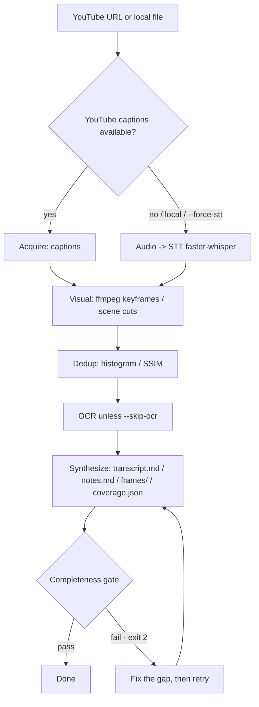

# LecturAL

> A Claude Code plugin that turns one YouTube video or local lecture file into complete markdown notes — **every utterance, every on-screen text, every scene**. Best on lecture and slide-style videos.

[](https://www.python.org/)
[](LICENSE)

## Features

- 🧾 **Full transcript + study notes** — a raw `transcript.md` (every utterance) and a seven-section `notes.md` (3줄 요약 / 목차 / 흐름 / 핵심 개념·이론 / 정리 노트 / 복습 질문 / 정리 커버리지). Note prose is Korean by design.
- 🔗 **Video deeplinks** — YouTube inputs use `youtu.be?t=` links; local media uses `transcript.md#tHHMMSS[-n]` anchors.
- 🇰🇷 **Korean & English** — uses YouTube captions when available, falls back to speech-to-text (faster-whisper) otherwise. Local files always use STT.
- 🚧 **Completeness gate** — checks speech gaps, scene coverage, and artifact presence, and blocks "done" until they pass. `--skip-ocr` keeps scene frames and skips only the slide-text OCR check.

## How it works


```mermaid
flowchart TD
    A[YouTube URL or local file] --> B{YouTube captions available?}
    B -->|yes| C[Acquire: captions]
    B -->|no / local / --force-stt| D[Audio -> STT faster-whisper]
    C --> E[Visual: ffmpeg keyframes / scene cuts]
    D --> E
    E --> F[Dedup: histogram / SSIM]
    F --> G[OCR unless --skip-ocr]
    G --> H[Synthesize: transcript.md / notes.md / frames/ / coverage.json]
    H --> I{Completeness gate}
    I -->|pass| J[Done]
    I -->|fail · exit 2| K[Fix the gap, then retry]
    K --> H
```

Local `.wav` skips the visual path. Local video/audio never use yt-dlp.

## Requirements

- **Python 3.10+**
- **uv** — installs and runs the Python dependencies
- **ffmpeg** — system binary, must be on PATH (STT/VAD and local-video audio extraction)
- **yt-dlp** — YouTube only; checked and installed by `/lectural:setup` (doctor)

## Install

### 1. Install the plugin (Claude Code)

```text
/plugin marketplace add haesol-shin/lectural
/plugin install lectural@lectural
```

This registers the completeness Stop hook and the `/lectural:notes` and `/lectural:setup` commands.

### 2. Prepare the runtime

Run once after installing:

```text
/lectural:setup
```

It installs the Python run dependencies → checks/repairs `ffmpeg` and `yt-dlp` → reports anything left to do. Local-only runs need ffmpeg, not yt-dlp.

> Manual setup: `uv pip install -e ".[run]"`, then install `ffmpeg` per OS (Windows `winget install --id Gyan.FFmpeg -e`, Linux `sudo apt-get install ffmpeg`, macOS `brew install ffmpeg`).

## Quick start

```text
/lectural:notes https://youtu.be/<VIDEO_ID>
/lectural:notes ./recording.mp4 --skip-ocr
/lectural:notes ./audio.wav
```

Or run the CLI directly without Claude Code (ffmpeg must be installed separately):

```bash
uvx --from ".[run]" lectural "https://youtu.be/<VIDEO_ID>" --out ./output
uvx --from ".[run]" lectural ./recording.mp4 --skip-ocr --out ./output
```

## Usage

| Command | Description |
|---------|-------------|
| `/lectural:setup` | Prepare and verify the runtime (first run) |
| `/lectural:notes <source> [options]` | Turn a lecture URL or local file into complete notes |

Options: `--force-stt` (ignore captions, force STT), `--model medium|small` (STT model size), `--out ./output` (output location), `--keep-frames`, `--skip-ocr` (keep scene frames, skip OCR). Pass multiple YouTube URLs/IDs or existing `.mp4`/`.webm`/`.mkv`/`.wav` files to process them sequentially.

The commands run **only on explicit request** (they do not auto-trigger on a stray YouTube link). At session end, the Stop hook re-verifies note completeness.

## Output

```text
output/<video-title>/
├── transcript.md          # raw timestamped transcript — every utterance
├── notes.md               # study notes: seven sections + source-appropriate citations
├── frames/                # scene images (video sources)
├── coverage.json          # completeness-gate results
└── synthesis_input.json   # text input used to enrich the notes
```

## FAQ

**No captions?** STT transcribes audio when captions are missing or weak (`--force-stt` forces it). Local files always use STT.

**Does a local run need yt-dlp?** No.

**What does `--skip-ocr` do?** Keeps scene frames, skips OCR, and relaxes only the slide-text OCR gate.

**Long video (1–2h)?** CPU STT gets slower with length; LecturAL warns on very long inputs, and `--model small` trades accuracy for speed.

**Empty OCR text on some frames?** Expected. Many frames (e.g. the speaker only) have no text, so OCR miss rate is not used as a gate.

## License

[MIT](LICENSE).
