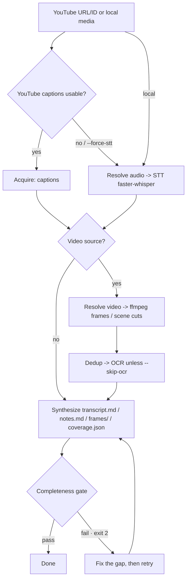

# LecturAL

> A Claude Code plugin that turns YouTube or local lecture media into complete markdown notes — every utterance, every on-screen text, every scene. Best on lecture and slide-style videos.

[](https://www.python.org/)
[](LICENSE)

## Features

- **Full transcript + study notes** — a raw `transcript.md` (every utterance) and a seven-section `notes.md` (3줄 요약 / 목차 / 흐름 / 핵심 개념·이론 / 정리 노트 / 복습 질문 / 정리 커버리지). Note prose is Korean by design.
- **Source-aware citations** — YouTube inputs use `https://youtu.be/<VID>?t=<sec>` links; local media uses exact relative `transcript.md#tHHMMSS[-n]` anchors.
- **YouTube and local media** — accepts YouTube URLs/IDs and existing `.mp4`, `.webm`, `.mkv`, or `.wav` files. Local media is read in place, uses STT, and never invokes yt-dlp.
- **Korean & English speech** — uses YouTube captions when available, falling back to speech-to-text (faster-whisper) otherwise; local inputs always use STT.
- **Completeness gate** — checks speech gaps, applicable scene coverage, source-appropriate citations, and artifact presence, and blocks "done" until they pass.

## How it works


```mermaid
flowchart TD
    A[YouTube URL/ID or local media] --> B{YouTube captions usable?}
    B -->|yes| C[Acquire: captions]
    B -->|no / --force-stt| D[Resolve audio -> STT faster-whisper]
    A -->|local| D
    C --> E{Video source?}
    D --> E
    E -->|yes| F[Resolve video -> ffmpeg frames / scene cuts]
    E -->|no| H[Synthesize transcript and whole-source notes]
    F --> G[Dedup -> OCR unless --skip-ocr]
    G --> H[Synthesize transcript.md / notes.md / frames/ / coverage.json]
    H --> I{Completeness gate}
    I -->|pass| J[Done]
    I -->|fail · exit 2| K[Fix the gap, then retry]
    K --> H
```

## Requirements

- **Python 3.10+**
- **uv** — installs and runs the Python dependencies
- **ffmpeg** — system binary, required for STT/VAD and local-video audio extraction
- **yt-dlp** — required only for YouTube metadata/media acquisition and checked by `/lectural:setup`

## Install

### 1. Install the plugin (Claude Code)

```text
/plugin marketplace add haesol-shin/lectural
/plugin install lectural@lectural
```

This registers the completeness Stop hook and the `/lectural:notes` and `/lectural:setup` commands.

### 2. Prepare the runtime

Run once after installing:

```text
/lectural:setup
```

It installs the Python run dependencies, checks/repairs `ffmpeg` and `yt-dlp`, and reports anything left to do. A local-only run still needs ffmpeg but does not need yt-dlp.

> Manual setup: `uv pip install -e ".[run]"`, then install `ffmpeg` per OS (Windows `winget install --id Gyan.FFmpeg -e`, Linux `sudo apt-get install ffmpeg`, macOS `brew install ffmpeg`).

## Quick start

```text
/lectural:notes https://youtu.be/<VIDEO_ID>
/lectural:notes ./recording.mp4 --skip-ocr
/lectural:notes ./audio.wav
```

Or run the CLI directly without Claude Code (ffmpeg must be installed separately; yt-dlp is needed for YouTube):

```bash
uvx --from ".[run]" lectural "https://youtu.be/<VIDEO_ID>" --out ./output
uvx --from ".[run]" lectural ./recording.mp4 --skip-ocr --out ./output
```

## Usage

| Command | Description |
|---------|-------------|
| `/lectural:setup` | Prepare and verify the runtime (first run) |
| `/lectural:notes <source> [options]` | Turn YouTube or local lecture media into complete notes |

Accepted sources: YouTube URLs/IDs and existing local `.mp4`, `.webm`, `.mkv`, or `.wav` files. Pass multiple sources to process them sequentially; mixed source batches are supported.

Options: `--force-stt` (ignore YouTube captions, force STT), `--model medium|small` (STT model size), `--out ./output` (output location), `--keep-frames` (archive extra raw sampled frames), and `--skip-ocr` (keep deduplicated scene frames but skip OCR and only the slide-text coverage predicate). For local `.wav`, visual flags are accepted but visual/OCR stages are not applicable.

The commands run only on explicit request. At session end, the Stop hook re-verifies note completeness, including source-appropriate citations and frame requirements.

## Output

```text
output/<title-or-stem>/
├── transcript.md          # raw timestamped transcript with tHHMMSS[-n] cue anchors
├── notes.md               # seven-section study notes and source-appropriate citations
├── frames/                # deduplicated scene images for video sources
├── coverage.json          # schema-version-2 completeness-gate results
└── synthesis_input.json   # schema-version-2 handoff used to enrich the notes
```

For local audio, the detail section covers the whole source and no image is required. Local video and YouTube video retain their deduplicated frame links independently of `--keep-frames`; `--keep-frames` additionally archives raw samples under `frames/raw/`.

## FAQ

**No YouTube captions?** STT transcribes audio when captions are missing or weak; `--force-stt` forces it. Local media always uses STT.

**Does a local run need yt-dlp?** No. Local WAV is read directly, and local video uses ffmpeg only to generate `output/<stem>/audio.wav` for STT.

**What does `--skip-ocr` do?** It retains and links deduplicated scene frames, skips OCR, and relaxes only the slide-text OCR gate. Speech coverage, frame timeline coverage, artifacts, notes structure, citations, and CLI exit behavior remain required.

**Long video (1–2h)?** CPU STT gets slower with length; LecturAL warns on very long inputs, and `--model small` trades accuracy for speed.

**Empty OCR text on some frames?** Expected in default mode for frames without slide text. With `--skip-ocr`, OCR is disabled but all deduplicated scene frames remain first-class artifacts and their actual empty OCR counts remain visible.

## License

[MIT](LICENSE).
